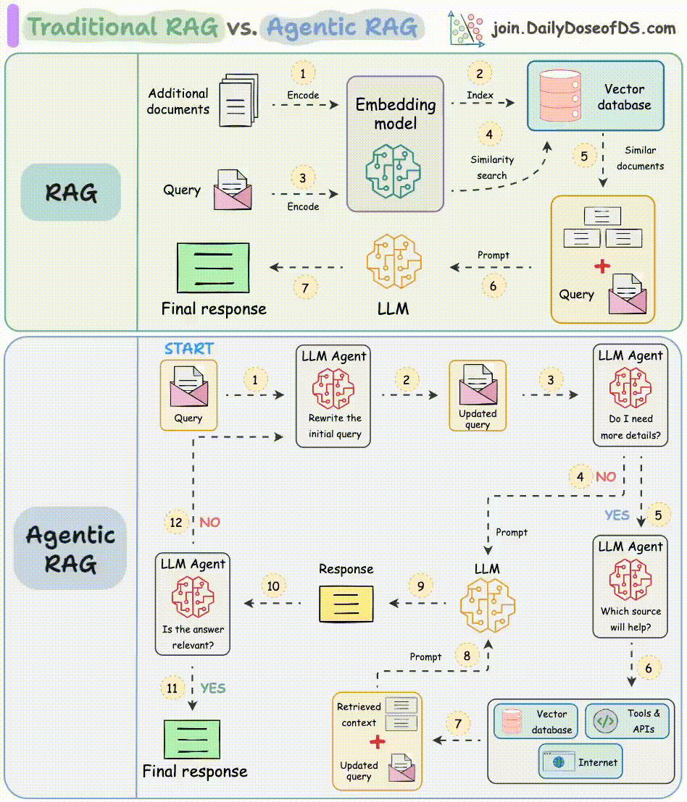
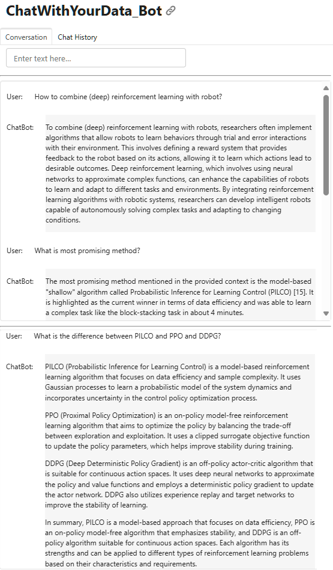
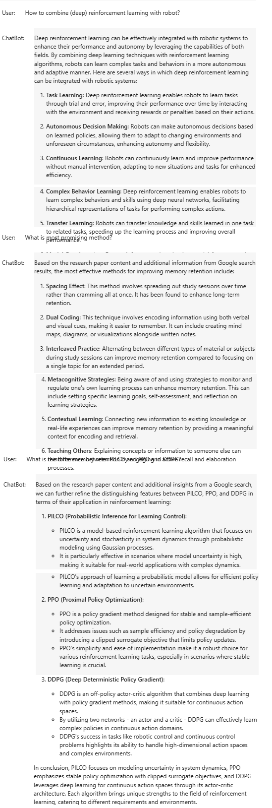

# LLM demo with RAG and LLM Agent as Research Assistant

Check out the `LLM_Agent` for the code I created.
> if you want to try it out, remember to check [this](environment_setup.md) to set up your environment.

Here in `RAG_Trad.ipynb` and `RAG_Agentic.ipynb` I created a traditional and agentic RAG chatbot to help me read papers (I know, researchers headache right?). The framework I used is LangChain

[Here](https://kexinwei.org/blog/llm_agent/) is my blog and thoughts about RAG and LLM agent.

[LLM Agent AICamp 2025 Jan 01~05](https://kexinwei.org/logseq_notes/#/page/llm%20agent%20aicamp%202025%20jan%2001~05) and [LLM AICamp 2025 Jan06-12](https://kexinwei.org/logseq_notes/#/page/llm%20aicamp%202025%20jan06-12) are the notes that I took during the course (!Alert, it may be quite messy, but the references materials are useful).

## Tradition RAG Chatbot
Can tell the result is not bad

## Agentic RAG Chatbot

The result is more comprehensive and detailed, but less focused on the database.

Maybe need a better prompt or a more reasonable structure to make it more focused on the database

